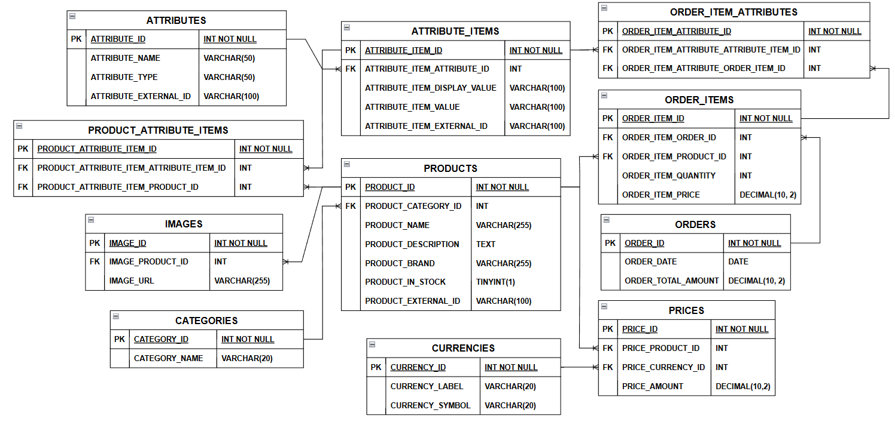

# Full-Stack E-Commerce Application

This project is a **full-stack e-commerce application** built using **PHP, GraphQL, React, and MySQL**.
It provides a product catalog, category browsing, attribute selection, and order placement functionality.

The backend exposes a **GraphQL API** responsible for retrieving product data and processing orders, while the frontend provides a modern interactive UI built with **React, TypeScript, and Tailwind CSS**.

---

# Table of Contents

- [Introduction](#introduction)
- [How to Run the Project](#how-to-run-the-project)
- [Data Overview](#data-overview)
- [Technologies Used](#technologies-used)
- [Database](#database)
- [Backend](#backend)
- [Frontend](#frontend)

---

# Introduction

This project implements a **full-stack e-commerce system** where users can:

* Browse product categories
* View detailed product information
* Select product attributes
* Add products to the cart
* Place orders

The backend provides a **GraphQL API** that retrieves products, categories, prices, and attributes from a MySQL database and allows order creation through a mutation.

The frontend consumes this API to present a responsive and interactive shopping experience.

---

Below is an additional section you can append to your `README.md`. It explains **composer setup, database setup, and running the seed script**, which reviewers expect for projects like this.

---

# How to Run the Project

Follow the steps below to run the project locally.

---

### 1. Clone the Repository

```
git clone https://github.com/GiorgiEz/eCommerceWebsite.git
cd eCommerceWebsite
```

---

### 2. Install Backend Dependencies

The backend uses **Composer** for dependency management.

If Composer is not installed, install it from:

```
https://getcomposer.org
```

Then install project dependencies:

```
composer install
```

This will install required libraries such as:

* `webonyx/graphql-php`
* `vlucas/phpdotenv`
* `nikic/fast-route`

---

### 3. Configure Environment Variables

Create a `.env` file in the project root if it does not already exist.

Example configuration:

```
DB_HOST=localhost
DB_PORT=3306
DB_NAME=ecommerce_store
DB_USER=root
DB_PASS=
```

These variables are used by the database connection class.

---

### 4. Create the Database

Start **XAMPP** and ensure the following services are running:

* Apache
* MySQL

Then create the database:

```
ecommerce_store
```

The database schema is located in:

```
resources/schema.sql
```

Import it using phpMyAdmin or MySQL CLI.

---

### 5. Seed the Database

The project includes a CLI script that loads the provided dataset and populates the database.

Location:

```
bin/seed.php
```

Run the script from the command line:

```
php bin/seed.php
```

The seeder will:

1. Load the dataset using the `JsonLoader` utility.
2. Insert categories.
3. Insert products.
4. Insert attributes and attribute items.
5. Insert prices and currencies.
6. Insert product-attribute relationships.
7. Insert product images.

This populates the database with the data provided in the assignment.

---

### 6. Start the Backend Server

If using XAMPP, place the project inside the `htdocs` directory.

Example path:

```
/Applications/XAMPP/xamppfiles/htdocs/ecommerceWebsite
```

The GraphQL endpoint will be available at:

```
http://localhost/ecommerceWebsite/public/graphql
```

All API requests should be sent to this endpoint.

---

##3 7. Running the Frontend

Navigate to the frontend directory and install dependencies:

```
npm install
```

Then start the development server:

```
npm run dev
```

The frontend will connect to the backend GraphQL API to retrieve products, categories, attributes, and to submit orders.

---

### 8. Testing the GraphQL API

You can test the API using tools such as:

* Postman
* Insomnia
* GraphQL Playground

Example query:

```
{
  products {
    name
    brand
    inStock
  }
}
```

Example mutation:

```
mutation {
  createOrder(input: {...})
}
```

---

# Data Overview

The application uses a dataset containing **categories, products, prices, attributes, and images**.

### Categories

Each category contains:

```
name
```

Example:

```
tech
clothes
all
```

---

### Products

Each product contains:

```
id
name
inStock
gallery (array of image URLs)
description
category
brand
prices (array)
attributes (array)
```

---

### Prices

Prices are represented as objects:

```
{
  amount
  currency {
      label
      symbol
  }
}
```

Example:

```
{
  amount: 1688.03
  currency:
    label: "USD"
    symbol: "$"
}
```

---

### Attributes

Products can have multiple attributes.

Each attribute object contains:

```
id
name
type
items (array)
```

Each attribute item contains:

```
id
displayValue
value
```

Example:

```
Size
  ├── 40
  ├── 41
  └── 42

Color
  ├── Red
  ├── Green
  └── Blue
```

These attributes allow selecting different product variations.

---

# Technologies Used

### Backend Technologies

* PHP **8.1**
* GraphQL (webonyx/graphql-php)
* FastRoute
* Composer

### Frontend Technologies

* React
* TypeScript
* Vite
* Tailwind CSS

### Database Technologies

* MySQL (Generic SQL)
* XAMPP used for local development

---

# Database

The database is designed in **Third Normal Form (3NF)** to eliminate redundancy and ensure data consistency.

The schema consists of the following tables:

* **CATEGORIES**
* **PRODUCTS**
* **PRICES**
* **CURRENCIES**
* **IMAGES**
* **ATTRIBUTES**
* **ATTRIBUTE_ITEMS**
* **PRODUCT_ATTRIBUTE_ITEMS**
* **ORDERS**
* **ORDER_ITEMS**
* **ORDER_ITEM_ATTRIBUTES**

### Database Relationships (ER Model)



Key relationships include:

* A **category** contains many products.
* A **product** can have many prices (for different currencies).
* A **product** can have many images.
* A **product** can have multiple attributes.
* Attributes contain multiple **attribute items**.
* Orders contain **order items**.
* Order items store selected **attribute items**.

---

### Data Loading

The backend loads the initial dataset from the provided JSON file.

### JSON Loader

A utility class `JsonLoader` reads the dataset file and converts it into PHP arrays.

### Seeders

Seeders exist for each table and are responsible for inserting data into the database.

### Repositories

Repositories are responsible for retrieving data from the database.

Examples:

```
ProductRepository
CategoryRepository
PriceRepository
AttributeRepository
OrderRepository
```

Repositories provide the data used by GraphQL queries and mutations.

---

# Backend

The backend is built using **PHP with GraphQL** and follows an **object-oriented architecture**.

---

### Application Entry Point

```
public/index.php
```

This file:

* loads environment variables
* registers the `/graphql` endpoint
* initializes the router using **FastRoute**

All API requests are handled through this GraphQL endpoint.

---

### GraphQL Controller

```
src/Controller/GraphQL.php
```

This class is responsible for:

* constructing the GraphQL schema
* executing queries and mutations
* creating the request context

The request context contains **data loaders** used to optimize database access.

---

### Data Loaders

Loader classes prevent repeated database queries by **preloading data once and reusing it**.

Examples:

```
PriceLoader
AttributeLoader
```

For example:

* prices for multiple products are loaded in a single query
* attributes and attribute_items are loaded once and reused

This reduces the **N+1 query problem**.

---

### GraphQL Schema

The schema defines the available queries and mutations.

#### Query Types

Available queries:

```
products
product
categories
```

### Mutation Types

Available mutation:

```
createOrder
```

This mutation inserts a new order together with all order items and selected attribute options.

---

### GraphQL Types

GraphQL types are defined for each model:

```
Product
Category
Price
Currency
AttributeSet
AttributeItem
```

Additionally, input types exist for creating orders:

```
CreateOrderInput
OrderItemInput
SelectedAttributeInput
```

---

# Frontend

### Overview

The frontend is a **React SPA (Single Page Application)** built with **Vite** and integrates with a GraphQL backend. It provides a complete e-commerce UI including product browsing, product details, cart management, and order placement.

---

### Tech Stack

* **React (Vite)** — UI framework
* **TypeScript** — type safety
* **React Router** — client-side routing
* **GraphQL (graphql-request)** — API communication
* **Tailwind CSS** — styling
* **Context API** — global state management

---

### Architecture

The frontend follows a **layered architecture**:

```text
Routing → Pages → Hooks → GraphQL → Context → UI Components
```

#### 1. Routing

* `/` → Product listing page
* `/product/:externalId` → Product details page

#### 2. Global State (Context)

* **CategoryContext** → manages selected category
* **CartContext** → manages cart items, total, and persistence (localStorage)

#### 3. Data Layer (Hooks)

Custom hooks abstract data fetching:

* `useCategories()` → fetch all categories
* `useProducts(category)` → fetch products by category
* `useProduct(id)` → fetch single product
* `useCreateOrder()` → create order mutation
* `useGraphQL` → reusable base hook (handles loading, error, data)

#### 4. Pages

* **ProductListPage** → displays products grid
* **ProductDetailsPage** → handles product configuration (attributes, gallery, add to cart)

#### 5. Components

* **Header** → navigation + cart access
* **CartOverlay** → cart UI, quantity updates, order handling
* **QuickShop** → quick add-to-cart from product list

#### 6. Utilities

Reusable helper functions:

* formatting prices
* truncating text
* transforming strings (e.g., kebab-case)

---

### Key Features

* Category-based product filtering
* Product detail page with:

    * image gallery
    * attribute selection (size, color, etc.)
* Cart functionality:

    * add/remove items
    * quantity control
    * persistent storage (localStorage)
* Quick shop (add to cart without opening product page)
* Order creation with GraphQL mutation
* Responsive UI

---

### Data Flow Example

```text
User selects category
→ CategoryContext updates
→ useProducts fetches data
→ UI re-renders product list

User adds item to cart
→ CartContext updates state
→ localStorage sync
→ CartOverlay reflects changes
```

---

### State Management

* **Local state** → UI-specific (selected attributes, gallery, toggles)
* **Global state (Context)** → shared data (cart, category)
* **Persistent state** → cart stored in localStorage

---

### Notes

* GraphQL is used to fetch only required data per view
* Custom hooks ensure separation of concerns and reusability
* Components are designed to be modular and composable
